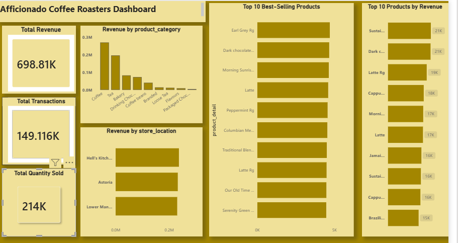
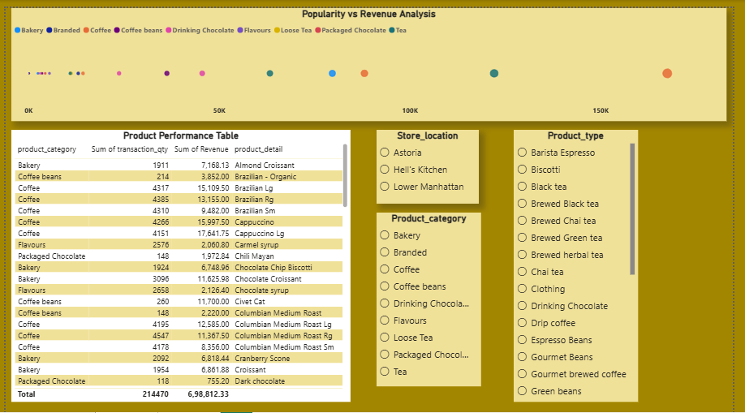

# Product Optimization & Revenue Contribution Analysis for Afficionado Coffee Roasters

## Project Overview

This project focuses on analyzing sales transactions of Afficionado Coffee Roasters to identify revenue-driving products, customer purchasing patterns, and store performance. The analysis helps support business decisions related to product optimization and revenue growth.

## Business Objective

The main objectives of this project are:

* Identify top revenue-generating products.
* Identify best-selling products based on quantity sold.
* Analyze revenue contribution by product category.
* Compare store-wise performance.
* Discover high-performing and low-performing products.
* Support data-driven business decisions.

## Dataset Information

The dataset contains transaction-level sales data, including:

* Transaction ID
* Transaction Quantity
* Store Location
* Product Category
* Product Type
* Product Detail
* Unit Price

A new Revenue column was created using:

Revenue = Transaction Quantity × Unit Price

## Tools Used

* Python
* Pandas
* Google Colab
* Power BI

## Data Cleaning & Preparation

The following steps were performed:

* Loaded transaction dataset
* Checked missing values
* Created Revenue column
* Performed exploratory data analysis (EDA)
* Generated business insights
* Exported cleaned dataset for Power BI

## Key Insights

### Store Performance

* Hell's Kitchen generated the highest revenue.
* Astoria ranked second.
* Lower Manhattan ranked third.

### Product Performance

* Barista Espresso generated the highest revenue among product types.
* Brewed Chai Tea recorded the highest sales quantity.
* Several products contributed significantly to overall business revenue.

### Revenue Contribution Analysis

A Pareto Analysis was performed to identify products contributing most of the revenue.

Approximately 42 products contributed nearly 80% of total revenue.

## Power BI Dashboard Features

### KPI Cards

* Total Revenue
* Total Transactions
* Total Quantity Sold

### Visualizations

* Revenue by Product Category
* Revenue by Store Location
* Top 10 Revenue Generating Products
* Top 10 Best-Selling Products
* Popularity vs Revenue Analysis (Scatter Plot)
* Product Performance Table

### Interactive Filters

* Store Location
* Product Category
* Product Type

## Dashboard Screenshots

### Executive Dashboard

### Product Analytics Dashboard

## Conclusion

This project successfully identified key revenue drivers, best-selling products, and store-level performance patterns. The insights generated can help Afficionado Coffee Roasters optimize product offerings, improve sales strategies, and increase overall business revenue.

## Author

Deepak Yadav
Data Analyst Project
